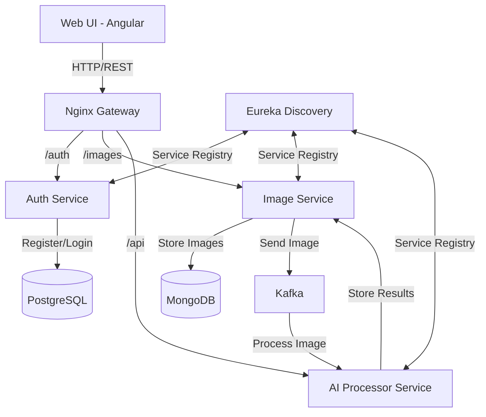

# Plant Recognition System

[](https://github.com/morthenn/plant-recognition/actions/workflows/build.yml)
[](https://github.com/morthenn/plant-recognition/actions/workflows/docker.yml)
[](https://github.com/morthenn/plant-recognition/actions/workflows/tests.yml)

A microservices-based plant recognition system that allows users to upload plant images and get predictions about the plant species.

## Architecture Overview



## Service Description

### Web UI (Angular)
- Modern responsive user interface
- Features:
  - User registration and authentication
  - Image upload and management
  - Plant recognition results viewing
  - User profile management

### Auth Service (Spring Boot)
- Handles user authentication and authorization
- JWT token-based authentication
- User management and role-based access control
- PostgreSQL for user data storage

### Image Service (Spring Boot)
- Manages image upload and storage
- Integrates with MongoDB for image metadata storage
- Publishes image processing requests to Kafka
- Stores and retrieves recognition results

### AI Processor Service (Python)
- Processes images using machine learning models
- Subscribes to Kafka for new image processing requests
- Performs plant species recognition
- Returns recognition results to Image Service

### Discovery Service (Eureka)
- Service registry and discovery
- Health monitoring
- Load balancing support

## Flow Description

1. **User Registration/Login Flow**
   - User registers/logs in through Web UI
   - Auth Service validates credentials
   - JWT token issued for authenticated requests

2. **Image Upload Flow**
   - User uploads image through Web UI
   - Image Service stores image in MongoDB
   - Image metadata published to Kafka topic
   - AI Processor receives image for processing
   - Results stored back in MongoDB
   - User notified of completion

3. **Results Retrieval Flow**
   - User requests recognition results
   - Image Service retrieves results from MongoDB
   - Results displayed in Web UI

## Setup Instructions

### Prerequisites
- Docker and Docker Compose
- Java 17
- Node.js 16+
- Python 3.8+

### Environment Setup
1. Clone the repository:
   ```bash
   git clone https://github.com/yourusername/plant-recognition.git
   cd plant-recognition
   ```

2. Configure environment variables:
   ```bash
   cp .env.example .env
   # Edit .env with your configurations
   ```

3. Build and start services:
   ```bash
   ./build.sh
   docker-compose up -d
   ```

### Service URLs
- Web UI: http://localhost:80
- Auth Service: http://localhost:8080
- Image Service: http://localhost:8081
- AI Processor: http://localhost:8082
- Discovery Service: http://localhost:8761

## Development

### Building Individual Services

**Auth Service:**
```bash
cd auth-service
./mvnw clean package
```

**Image Service:**
```bash
cd image-service
./mvnw clean package
```

**AI Processor Service:**
```bash
cd ai-processor-service
pip install -r requirements.txt
```

**Web UI:**
```bash
cd web-ui/angular-app
npm install
npm run build
```

### Running Tests
```bash
# Auth Service Tests
cd auth-service
./mvnw test

# Image Service Tests
cd image-service
./mvnw test

# AI Processor Tests
cd ai-processor-service
python -m pytest

# Web UI Tests
cd web-ui/angular-app
npm run test
```

## API Documentation

### Auth Service Endpoints
- POST `/api/auth/register` - User registration
- POST `/api/auth/login` - User login
- GET `/api/auth/user` - Get user profile

### Image Service Endpoints
- POST `/api/images/upload` - Upload image
- GET `/api/images` - List user's images
- GET `/api/images/{id}` - Get image details
- GET `/api/images/{id}/results` - Get recognition results

## Contributing
1. Fork the repository
2. Create your feature branch (`git checkout -b feature/amazing-feature`)
3. Commit your changes (`git commit -m 'Add amazing feature'`)
4. Push to the branch (`git push origin feature/amazing-feature`)
5. Open a Pull Request

## License
This project is licensed under the MIT License - see the [LICENSE](LICENSE) file for details. 